  

  

  

 

  
  &nbsp;
  

---

### // About

> *"I'm not going there to die. I'm going to find out if I'm really alive."* — Spike

Desenvolvedor Full Stack com experiencia em aplicacoes web em producao, atuando com **Python** (Django/FastAPI), **APIs REST**, **PostgreSQL**, **MongoDB** e pipelines ETL.

Vivencia em IoT (ESP32/C++), mobile (Flutter) e Machine Learning.

Graduando em **Sistemas de Informacao** pela UFRPE, com certificacoes **AWS** e atuacao em ambientes ageis.

 

---

### // Featured Projects

> *"The past is the past and the future is the future. A man is a man and a woman is a woman."* — Faye Valentine

<table>
  <tr>
    <td width="50%" valign="top">
      <h3><a href="https://github.com/LuisFilipeOliveiraSantos/ecocyclo_back">ecocyclo_back</a></h3>
      
API REST gamificada para descarte de lixo eletronico, com sistema de pontos, conquistas e registros de descarte. Documentacao automatica via Swagger/ReDoc.

      
      
      
      
    </td>
    <td width="50%" valign="top">
      <h3><a href="https://github.com/LuisFilipeOliveiraSantos/tempozero-back">tempozero-back</a></h3>
      
API REST para sistema automatizado de gerenciamento de apostas esportivas, com machine learning para analise de dados e previsoes de apoio a decisao.

      
      
      
    </td>
  </tr>
  <tr>
    <td width="50%" valign="top">
      <h3><a href="https://github.com/LuisFilipeOliveiraSantos/pullebyte-analises">pullebyte-analises</a></h3>
      
Dashboard interativo de data science com analise exploratoria, modelos de classificacao e interpretabilidade via SHAP.

      
      
      
    </td>
    <td width="50%" valign="top">
      <h3><a href="https://github.com/LuisFilipeOliveiraSantos/soiltune">soiltune</a></h3>
      
Sistema IoT de coleta e transmissao de dados industriais em tempo real para calibracao de sensores de umidade do solo, com firmware em C/C++ para ESP32.

      
      
      
      
    </td>
  </tr>
</table>

---

### // Stack

> *"A lesson without pain is meaningless."* — Ed

**Backend & APIs**

**Frontend & Mobile**

**Data & Cloud**

**Embarcados & IoT**

---

### // Stats

> *"Do not fear Death. Death is always at our side."* — Vicious

  
  

---

### // Contributions

  <picture>
    <source media="(prefers-color-scheme: dark)" srcset="https://raw.githubusercontent.com/LuisFilipeOliveiraSantos/LuisFilipeOliveiraSantos/output/github-contribution-grid-snake-dark.svg"/>
    <source media="(prefers-color-scheme: light)" srcset="https://raw.githubusercontent.com/LuisFilipeOliveiraSantos/LuisFilipeOliveiraSantos/output/github-contribution-grid-snake.svg"/>
    
  </picture>

---

  

